# Project 2

In this project, we are investigating the intersection between images and the frequency domain. We are primarily interested in how we can use our understanding of images as compositions of an infinite basis of frequencies to our advantage in a variety of image augmenting and composing tasks.

**Finite Difference Operator**

Here, we are interested in looking at edges. We will take the derivative convolutions over our images and look at the magnitude of the gradient.

Here we can see the basic cameraman image that we are going to be modifying.

Here we can see the dy and dy outputs from convolving over the input image. You can see how the dy image has more horizontal likes (vertical changes) and the opposite for dx.

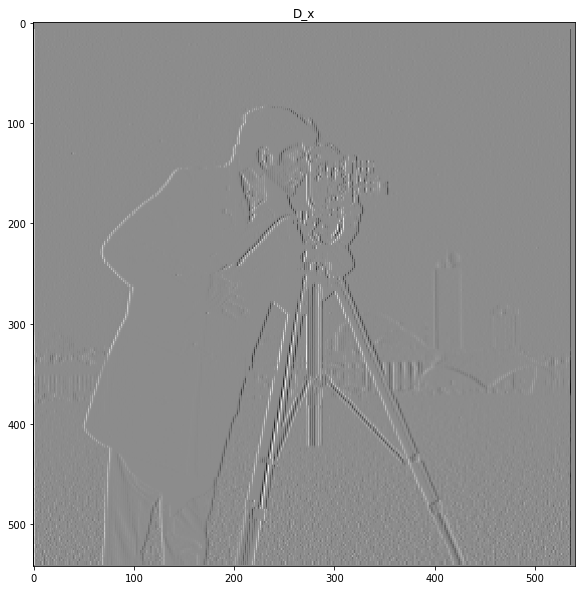
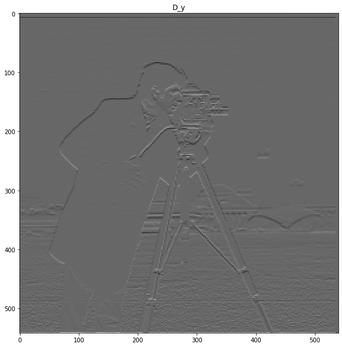

Here we can see the magnitude of the gradient, which is just the square root of the squares of dx and dy (all elementwise). This image pretty much captures the edges of our person.

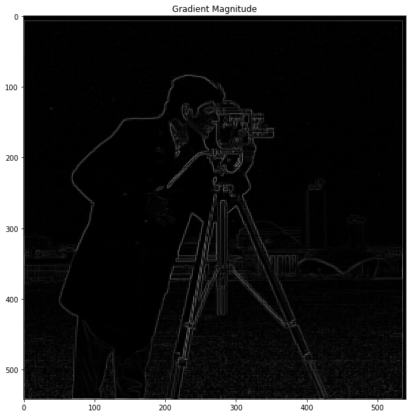

Here we can see some different threshold values. I found that values between .15 and .20 seemed to do the best job getting rid of the noise, without getting rid of good information. Unfortunately, no matter what the threshold was, some background information was always lost, though I'd really hoped that the background buildings would stay. If only the background buildings were slightly darker in color, the gradients would have been large enough to cross the threshold.

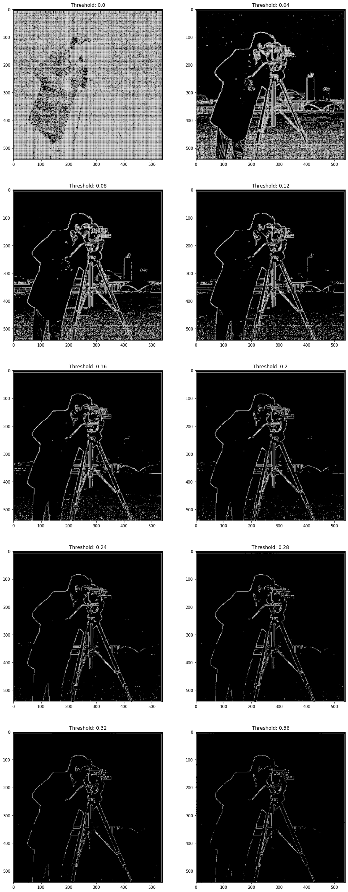

**DoG Filter**

Here, we want to look at blurring before we take the derivative. The derivative is particularly unstable in this discrete setting, especially when we have noise like the grass. We need to try and get rid of some of that noise before we take the derivative in the hopes of capturing some real edges, and getting less noise.

Due to the nice properties of convolutions, we can even create a single filter per direction that is a composition of both derivative and gaussian filters.

Here is the cameraman blurred before the derivative. We can see that it looks pretty similar... just slightly blurrier. Go figure right? A slightly heavier blur might get rid of a little more noise in the grass, but we would risk also smearing our real edges too much.

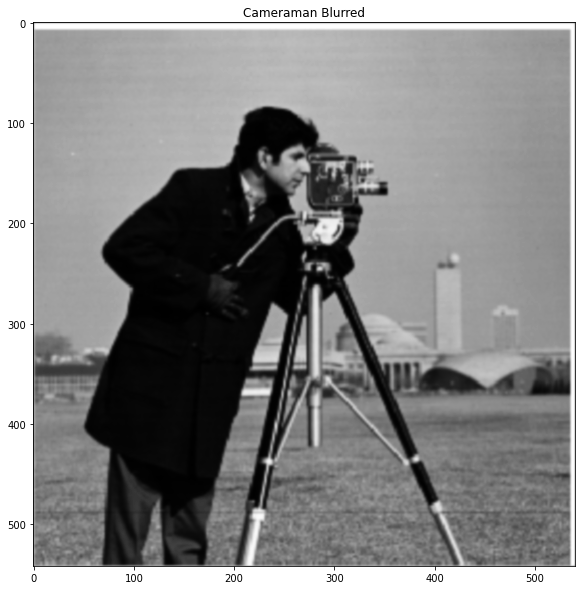

Here we can see the magnitude of the gradients. The edges here look pretty good overall. Generally, the lines look smoother (probably just because they are bolded and easier to see for human eyes) and perhaps a little brighter relative to the noise in the grass.  

Here we can do the thresholding again. Notice that the threshold values are significantly smaller than when we took the magnitude of the gradient without blurring first. In my opinion, .05 is the best threshold, since we still have some edges from the tall building in the background, and there is a steep drop off of noise in the grass between .04 and .05.

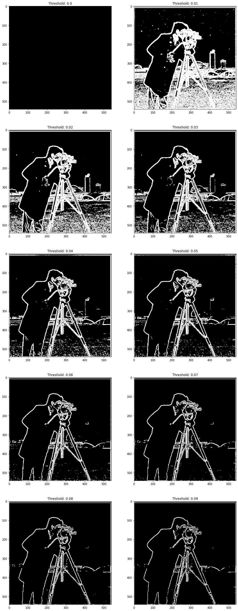

Below are all the tests ran again with the derivative of gaussian filter applied all at once through a single convolution operation with our specialized filter. You can see that everything looks the same. I chose to use a large filter size for the gaussian and also chose to have the gaussian filter size be even. This is because with same padding, odd sized gaussians would have strange edge behavior due the fact that we would use the padded zeros on one side, but not the other (remember, the derivative filter is 1x2). With an odd sized gaussian, with same padding, we use one zero at the edge on both sides for the direction of the derivative. This means that the filter is symmetrical, which is what we want.

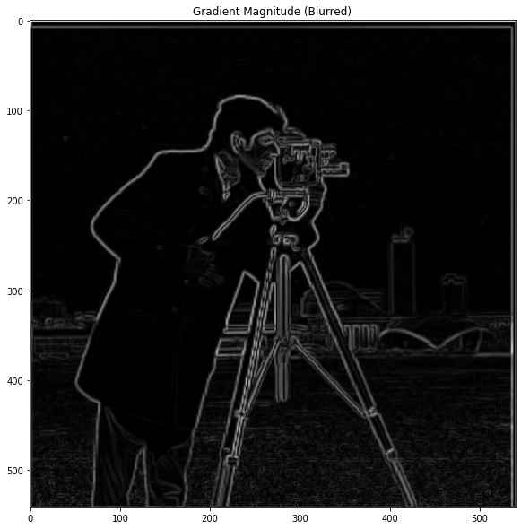

**Image Sharpening**

Here is our control.

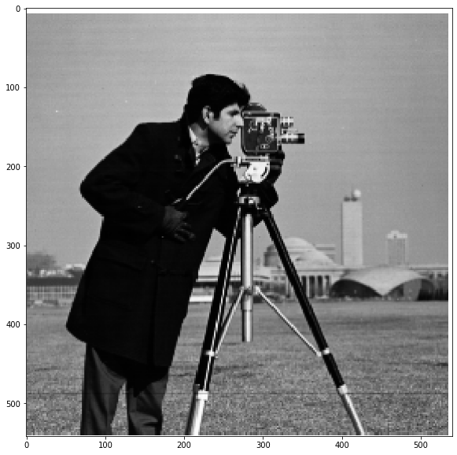

Here is a slightly sharper image. You can see that the lines around the hair, coat edge, and especially in the camera itself are much more pronounced. Unfortunately, the noise in the grass is too.

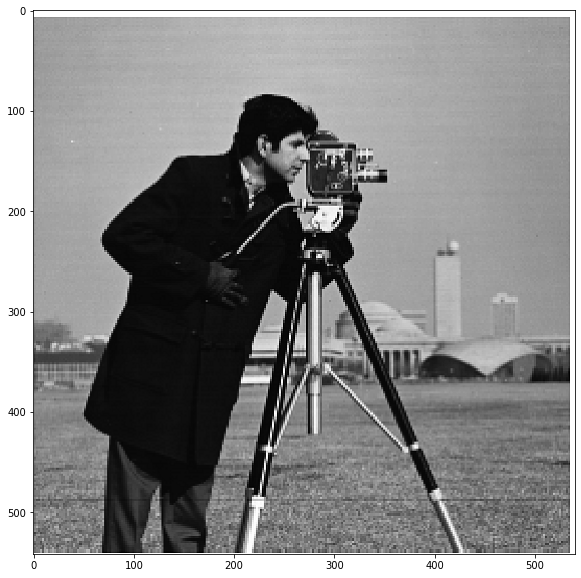

Here is a test to make sure my implementation with a single convolution operation all at once works in the same way. You can see that the images are identical.

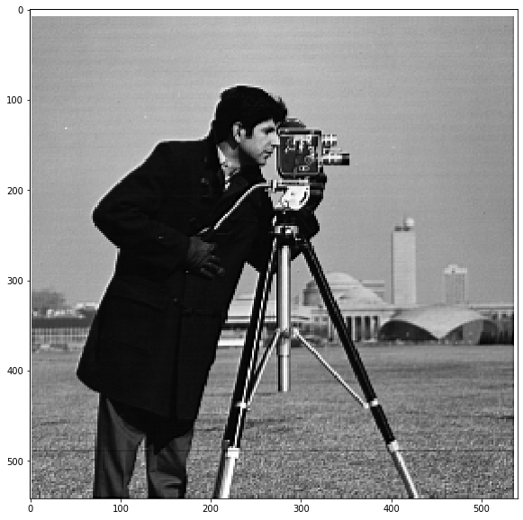

The results are pretty good. Colors aren't unbalanced or anything, and background/blurry features come more into view, and edges get sharper in general even for already sharp features. I suspect though that if I had a larger screen to view these images on, I would find the result less appealing since the sharpening would definitely make smaller features come more into view, distracting me from the primary object in the images.
In general, I didn't want to set the alpha value too high, so the difference is subtle, but it is there. The Taj Mahal has brighter scaffolding, the surfboard has sharper fins, the trees tend to have sharper more defined leaves, the blades of grass are more visible, and shingles are more visible.

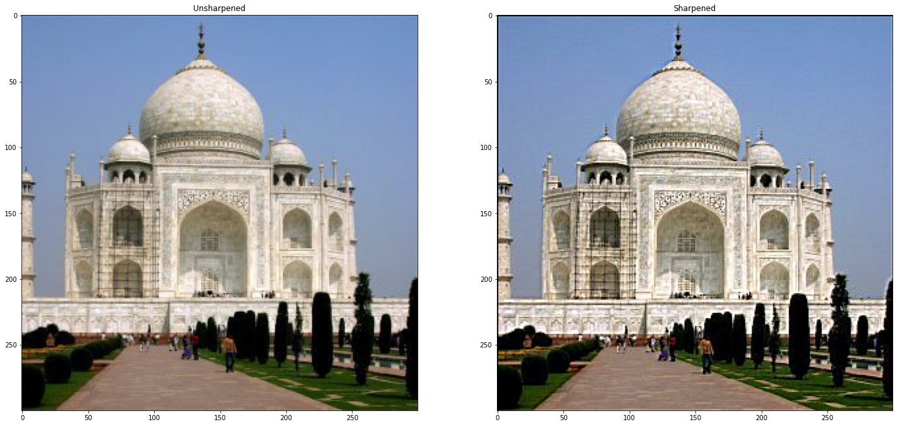
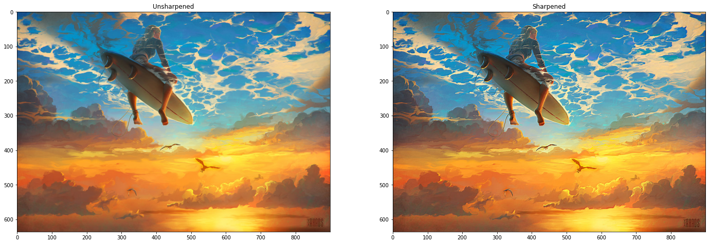
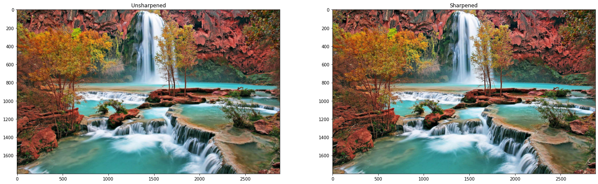
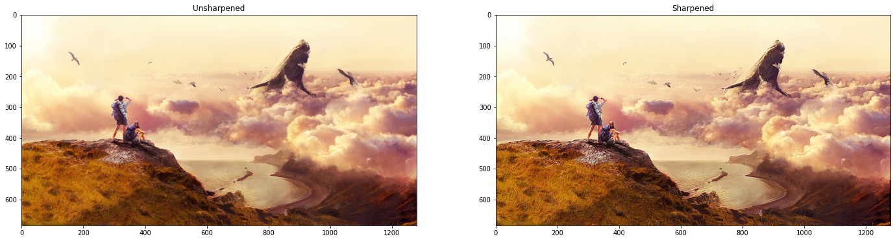
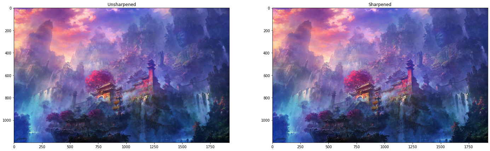

**Hybrid Images**

Here, we are merging the frequency domains of two different images by simply adding two processed images, one with high pass and one with low pass. It certainly isn't perfect, but it does work here. You can see the cat up close, but back away and the human is clearly there.

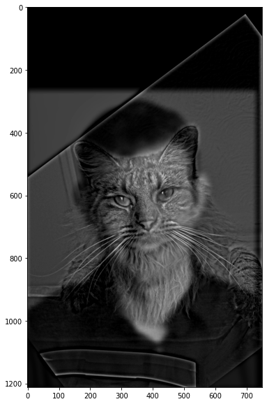

Here we can see the process of creating these. Here is the final product of a cybertruck that wished to be a real pickup:

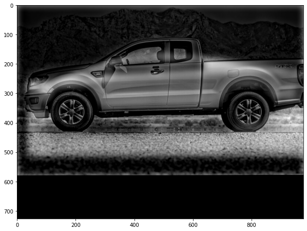

Here is the gaussian filter's small frequency domain.

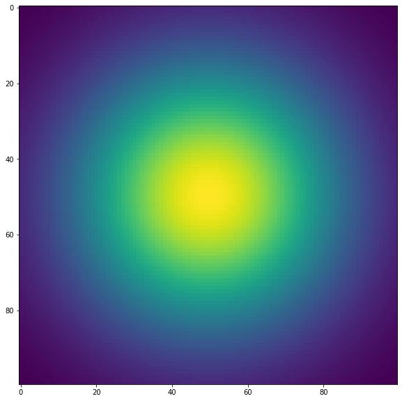
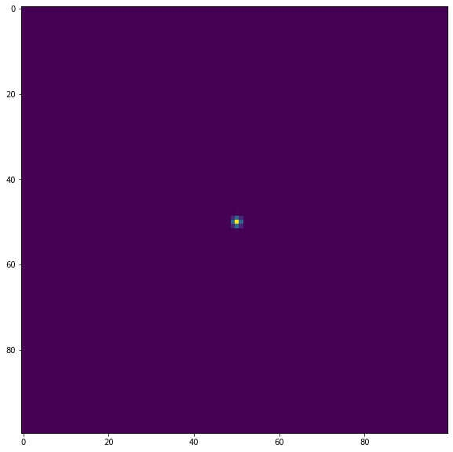

Here we can see the images and frequency domains of original images and images with a pass on them. The high pass filter gets rid of just the tiny center since we can see our frequency domain gaussian is tiny. In the low pass however, we only really keep the center (and the bars in frequency domain are so large that they are inevitable since our image alignment leaves massive vertical and horizontal lines on the border of the actual image).

Here are some more hybrids

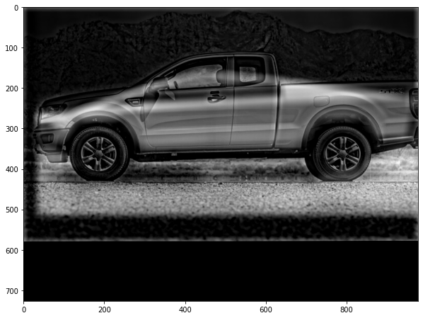
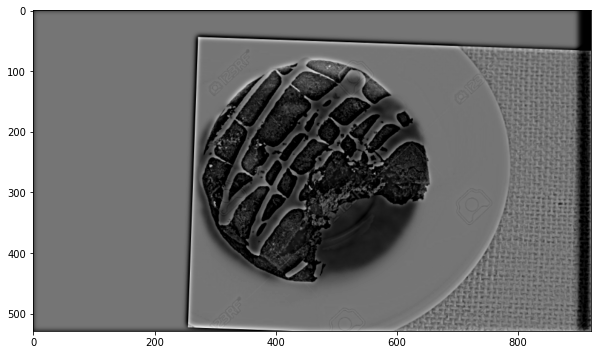

Bells and Whistles:
Here, I tried to combine color with the hybridization of our man/cat thing. I knew that we would need some color from both or it would look really strange with only cat fur or human skin tone, the question was just how much. I think I found a good balance where we did just mostly cat since the cat color is really dark and will blend in the the edges/borders in our image from afar when you see the human.

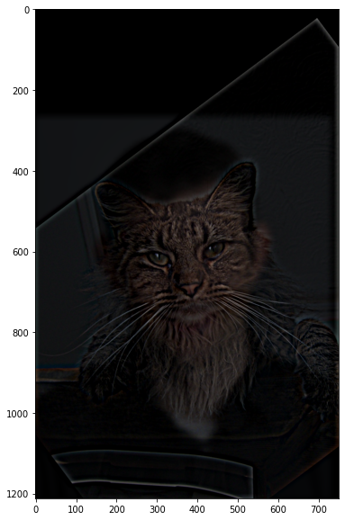

**Gaussian Stack**

Here, we are successively blurring more and more without downscaling to create our gaussian stack.

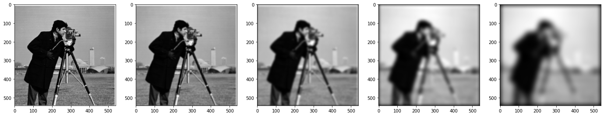

Here we can see the laplacian stack which is just the gaussian stack where each element in the gaussian stack is subtracted from the next element in the original gaussian stack.

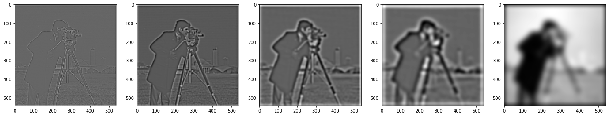

Here we can see a boosted laplacian stack (minus layers 1/3) which mimics the image in the paper. You can see the dimples on the orange in layer 0 where there is most detail, and the base colors at the bottom where its blurriest.

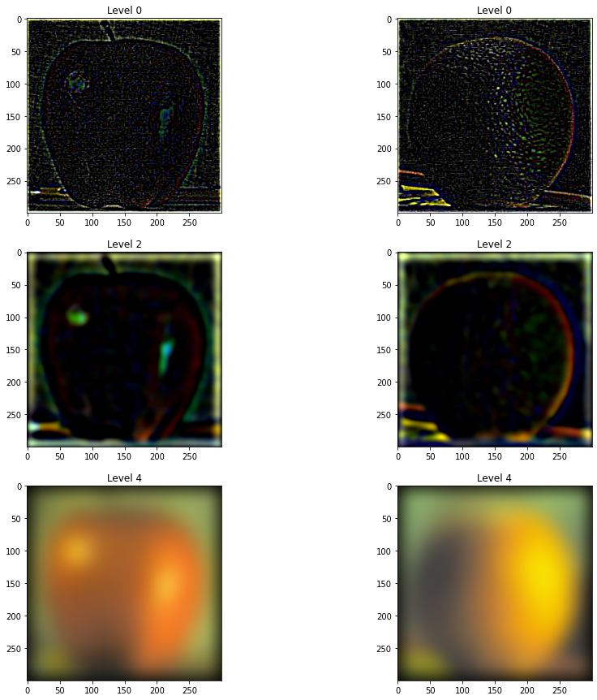

**Multiscale Images**

Here, we will blur a mask and then use that to weight the laplace pyramids of two images, adding them back together.

Here is the mask

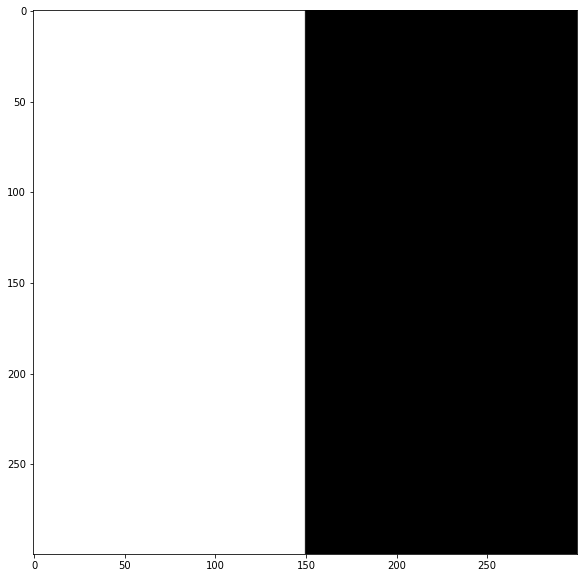

Here is the full thing

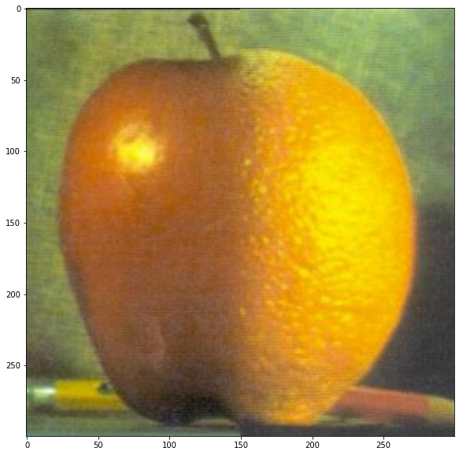

Here are some more images that I really like, blurred with my favorite image of all, the surfer in the sky!

Here is the process of creating another surfer in the sky of another image.

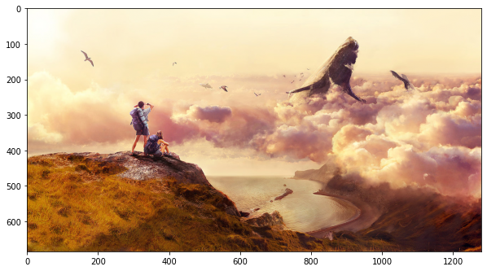
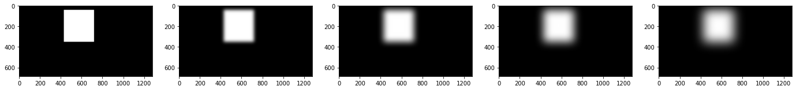

Here, I really turned up the blurring on the mask to make sure it fit nicely

Here are the pyramids of both Images
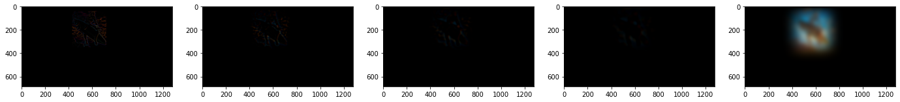
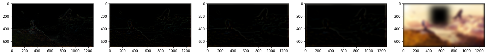
